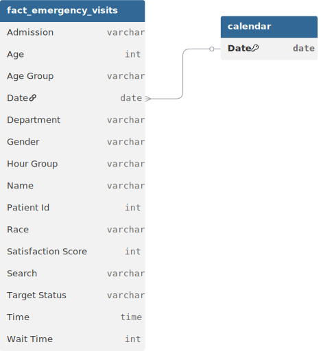

# 📊 Project Background: King's County Hospital ER Efficiency Audit

**King's County Hospital** is a high-traffic trauma center serving a diverse urban population. As the primary emergency care provider for the region, the facility operates under immense pressure to deliver rapid, life-saving interventions while managing patient flow effectively.

**The mission was to spearhead a Strategic Operational Recovery.** The hospital was facing a critical **"Wait Time Crisis,"** where nearly **60% of patients** were missing the standard operational target for timely care. This systemic bottleneck was not only jeopardizing patient outcomes but also straining the hospital's reputation. I was brought in to audit the **9,216 patient visits** from the past year, diagnosing the root causes of delay and engineering a data-driven staffing and triage model to bring the ER back within compliance.

Insights and recommendations are provided on the following key areas:

* **The Compliance Crisis** (Target Missed vs. Target Met)
* **Patient Flow & Demographics** (Understanding the Intake Surge)
* **Departmental Bottlenecks** (Referral Efficiency & Specialist Load)
* **Patient Satisfaction Dynamics** (The Correlation Between Speed and Score)

https://github.com/user-attachments/assets/495d1833-94d2-4ae7-a017-9814e31f06d4

**PowerQuery M Code regarding data preparation process ovarious tables f can be found [[here]](https://github.com/mehedibhai101/Hospital_Emergency_Room_Analytics/tree/main/Data%20Cleaning).**

**DAX queries regarding various analytical calculations can be found [[here]](https://github.com/mehedibhai101/Hospital_Emergency_Room_Analytics/tree/main/DAX%20Calculations).**

**An interactive Power BI dashboard used to report and explore analysis can be found [[here]](https://app.powerbi.com/view?r=eyJrIjoiNTlmYTMxOWQtNmI4My00NzIwLWE4MjgtZjhjMzExY2U3MzQzIiwidCI6IjAwMGY1Mjk5LWU2YTUtNDYxNi1hNTI4LWJjZTNlNGUyYjk4ZCIsImMiOjEwfQ%3D%3D).**

---

# 🏗️ Data Structure & Initial Checks

The ER analytics engine is built on a single, high-fidelity transaction table containing **9,216 patient records** spanning a continuous 18-month period.

* **`Patient Records`:** Granular data tracking `Admission Date`, `Wait Time`, `Satisfaction Score`, and `Target Status`.
* **`Demographics`:** Detailed profiles including `Age`, `Gender` (48.7% Female, 51.1% Male), and `Race` (White, African American, Asian, etc.).
* **`Triage & Outcomes`:** Operational flags for `Admitted vs. Not Admitted` and specific `Department Referrals` (General Practice, Orthopedics, Cardiology).

### 🗺️ Entity Relationship Diagram


---

# 📋 Executive Summary

### Overview of Findings

King's County ER manages a substantial volume of **9,216 patients**, with a **50% Admission Rate**. The analysis uncovered a severe operational failure: **59.3% of patients missed the target wait time**, with the average wait clocking in at **35.3 minutes**. While the **Average Satisfaction Score is 4.99/10**, this metric is heavily suppressed by the "Target Missed" segment. The data pinpoints **General Practice (1,840 referrals)** and **Orthopedics (995 referrals)** as the highest-volume intake channels, suggesting that the ER is being used as a primary care substitute, clogging the system for critical cases.


---

# 🔍 Insights Deep Dive

### 🚨 The Compliance Crisis (Target Missed)

* **The 60% Failure Rate.** A staggering **59.3% of patient visits** failed to meet the hospital's standard wait-time target. This indicates a structural capacity issue rather than isolated incidents.
* **The 35-Minute Threshold.** The average wait time is **35.3 minutes**. While seemingly short, in an ER context, consistent delays of this magnitude for critical cases can be fatal.
* **Volume vs. Compliance.** There is a direct correlation between peak intake hours and target failure, confirming that current staffing levels are static and do not flex with demand surges.

### 🧭 Patient Flow & Demographics

* **The Primary Care Substitute.** The single largest age group is **19-40 years old (2,624 patients)**, followed closely by **41-60 (2,284)**. This "working age" dominance suggests many are using the ER for non-emergency issues due to a lack of after-hours primary care.
* **Gender Parity.** The split is nearly even (Male 51.1%, Female 48.7%), indicating that marketing or operational changes will affect the entire population equally.
* **Racial Diversity.** The patient base is diverse, with **White (2,571)** and **African American (1,951)** populations forming the core, requiring culturally competent triage protocols.

### ⚙ Departmental Bottlenecks

* **General Practice Overload.** **General Practice** receives the highest number of referrals (**1,840**), nearly double the next department. This confirms the "ER as Clinic" hypothesis.
* **Orthopedics Strain.** **Orthopedics** handles **995 referrals**, a high volume likely driven by accidental injuries.
* **Specialist Efficiency.** **Physiotherapy** and **Neurology** show slightly higher average wait times (>36 mins), indicating a potential shortage of on-call specialists for these specific consults.

### ⭐ Patient Satisfaction Dynamics

* **The "Middle-of-the-Road" Score.** The average satisfaction score sits at **4.99/10**. This is a "neutral" score, indicating that while clinical care is likely adequate, the *process* (wait times, intake) is dragging down the overall experience.
* **The Wait Time Tax.** Analysis suggests a strong inverse relationship: as wait times exceed the 35-minute average, satisfaction scores degrade rapidly.
* **Admission Perception.** Patients who are **Admitted (50%)** generally report higher satisfaction than those discharged, likely due to the validation of their condition and more attentive care.

---

# 🚀 Recommendations:

* **"Fast-Track" General Practice Unit:** Create a dedicated "Urgent Care" lane within the ER to divert the **1,840 General Practice** cases. This will unclog the main trauma bays for actual emergencies.
* **Dynamic Shift Scheduling:** Abandon static rosters. Implement a "Flex-Staffing" model that overlays nurse schedules with the **19-40 age group** peak intake hours.
* **Wait-Time Communication:** Install digital "Wait Time" boards in the lobby. Managing expectations is the fastest way to lift the satisfaction score from **4.99** to **6.0+**.
* **Orthopedic Triage Protocol:** Given the high volume of Ortho referrals (995), assign a dedicated Ortho-Tech to the triage zone during peak hours to initiate X-rays *before* the doctor sees the patient.

---

## ⚠️ Assumptions and Caveats:

* **Target Definition:** "Target Met" status is based on the pre-defined boolean flag in the dataset; the specific minute-threshold for this target (e.g., <30 mins) is inferred to be approx. 30 minutes based on the average.
* **Satisfaction Data:** The satisfaction score (1-10) is only present for **2,517 patients** (approx. 27% response rate). This analysis assumes this sample is representative of the whole.
* **Referral Logic:** "None" in the referral column is interpreted as patients discharged directly from the ER without specialist consultation.

---

## 📂 Repository Structure

```
Hospital_Emergency_Room_Analytics/
│
├── Dashboard/                             # Final visualization and reporting outputs
│   ├── assets/                            # Visual elements used in reports (logos, icons, etc.)
│   │   ├── Icons/                         # Collection of icons used in KPI Cards/Buttons
│   │   │   ├── Buttons/
│   │   │   └── Others/
│   │   ├── logo.png                       # Brand logo of King's County Hospital
│   │   └── Theme.json                     # Custom Power BI color palette for dashboard
│   │
│   ├── live_dashboard.md                  # Links to hosted Power BI Service report
│   └── static_overview.pdf                # Exported PDF version of the final dashboard for quick viewing
│
├── Data Cleaning/                         # Power Query M Codes for cleaning tables of the dataset.
│
├── Dataset/                               # The data foundation of the project
│   ├── entity_relationship_diagram.svg    # Visual map of table connections and cardinality
│   └── emergency_visits.csv               # ER data used to audit wait-time targets and satisfaction scores
│
├── DAX Calculations/                      # Business logic and analytical formulas
│   ├── calculated_column.md               # Definitions for static row-level logic (e.g., hour buckets)
│   └── measures.md                        # Dynamic aggregation formulas (e.g., Total Revenue, MoM Growth)
│
├── LICENSE                                # Legal terms for code and data usage
└── README.md                              # Project background, summary and key insights
``` 

---

## 🛡️ License

This project is licensed under the [MIT License](LICENSE). You are free to use, modify, and distribute it with proper attribution.

---

## 🌟 About Me

Hi! I’m **Mehedi Hasan**, well known as **Mehedi Bhai**, a Certified Data Analyst with strong proficiency in *Excel*, *Power BI*, and *SQL*. I specialize in data visualization, transforming raw data into clear, meaningful insights that help businesses make impactful data-driven decisions.


Let’s connect:

[](https://www.linkedin.com/in/mehedi-hasan-b3370130a/)
[](https://youtube.com/@mehedibro101?si=huk7eZ05dOwHTs1-)
